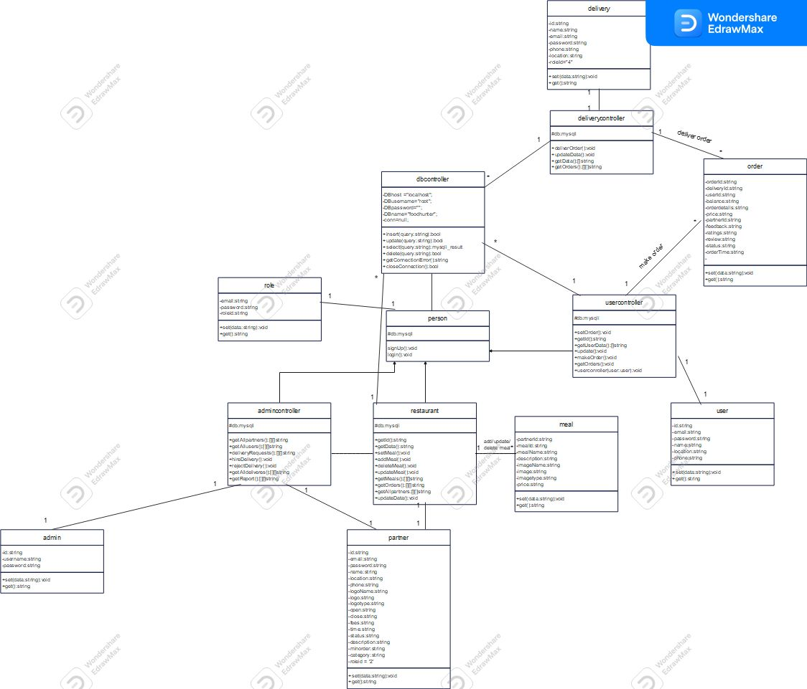
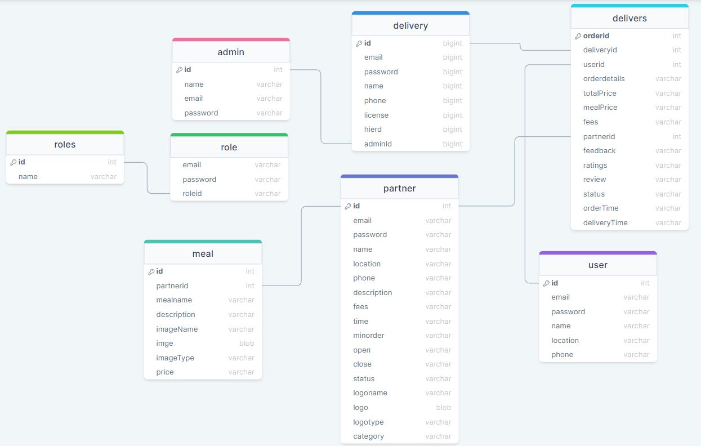

# Food-hunter

## Class Diagram

*Figure 1: Class Diagram*

The class diagram illustrates the relationships and interactions between different classes in our project. It provides a visual representation of the system's structure and helps in understanding the architecture.

## Database Tables

The image above showcases the database tables utilized in our project. These tables store and organize the project's data, allowing for efficient data retrieval and manipulation.

